# LX Notes Architecture - Mermaid Diagrams

> Reference documentation for the LX Notes codebase architecture.
> Keep this file up to date when making architectural changes.
> Last updated: 2026-02-25

## Table of Contents

1. [High-Level Architecture](#high-level-architecture)
2. [Route Structure](#route-structure)
3. [Provider & State Hierarchy](#provider--state-hierarchy)
4. [Data Flow - Production Load](#data-flow---production-load)
5. [Data Flow - Preset Updates](#data-flow---preset-updates)
6. [Data Flow - Notes CRUD](#data-flow---notes-crud)
7. [Offline Operation Queue](#offline-operation-queue)
8. [Zustand Store Map](#zustand-store-map)
9. [Component Architecture](#component-architecture)
10. [API Routes](#api-routes)
11. [Module System](#module-system)
12. [Realtime Sync](#realtime-sync)

---

## High-Level Architecture

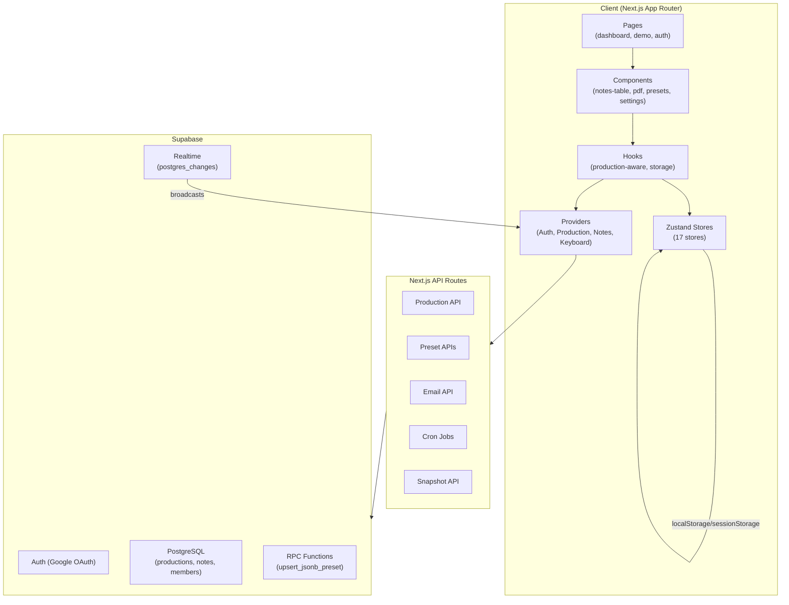

## Route Structure

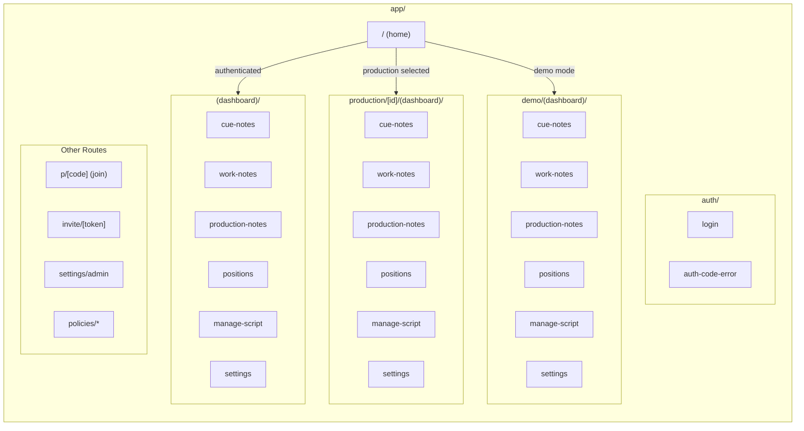

## Provider & State Hierarchy

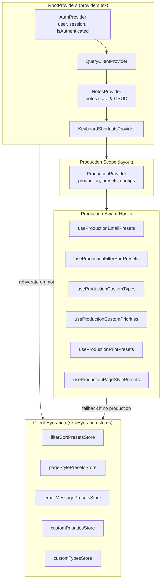

## Data Flow - Production Load

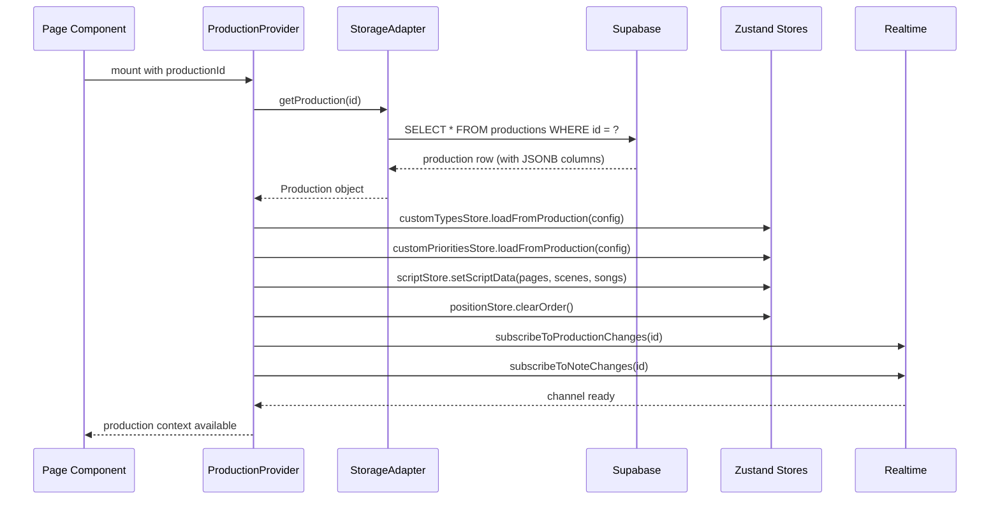

## Data Flow - Preset Updates

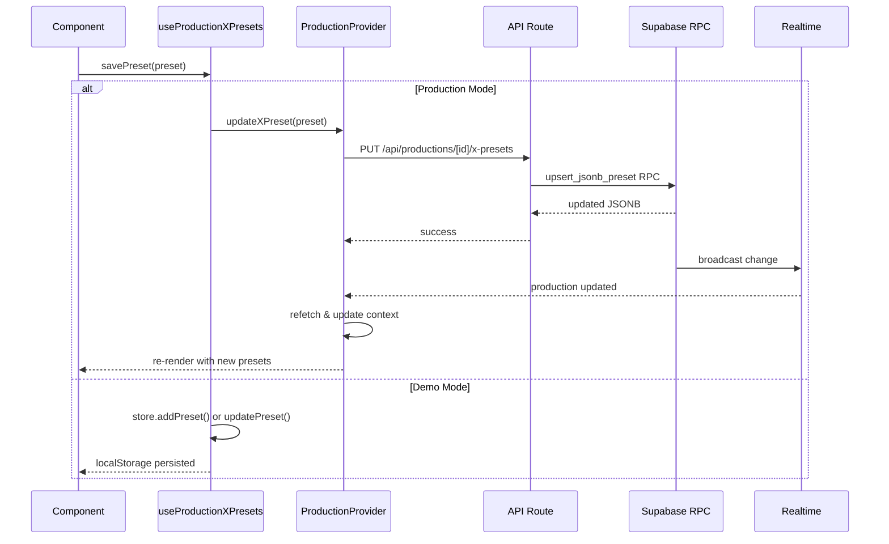

## Data Flow - Notes CRUD

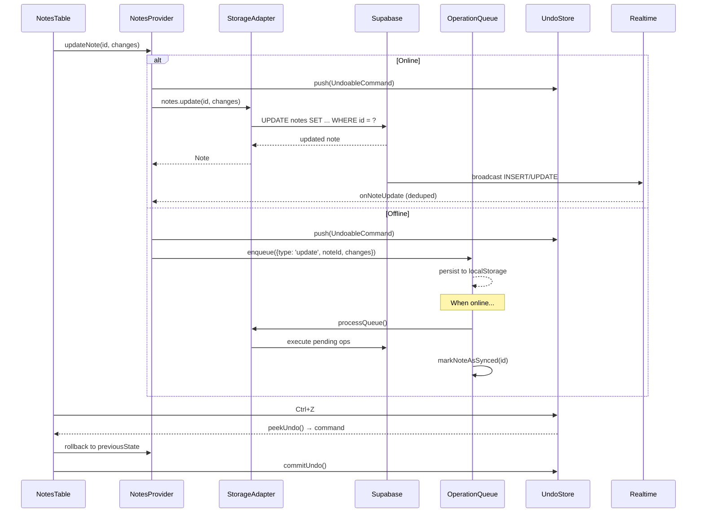

## Offline Operation Queue

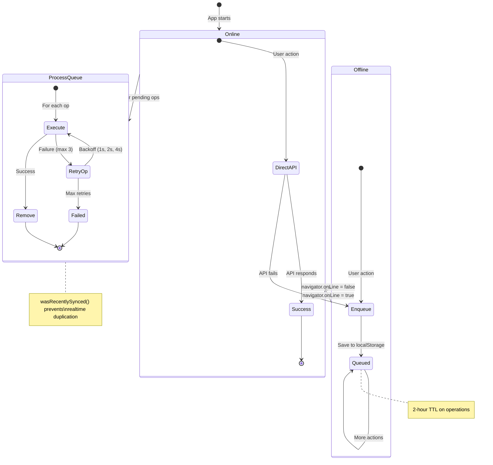

## Zustand Store Map

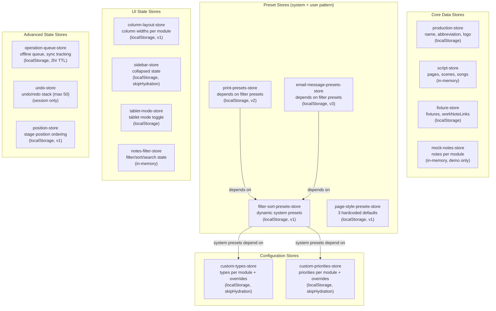

## Component Architecture

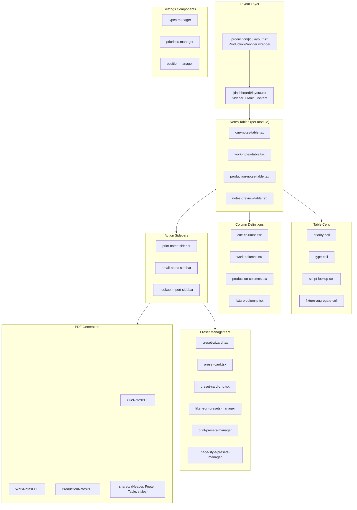

## API Routes

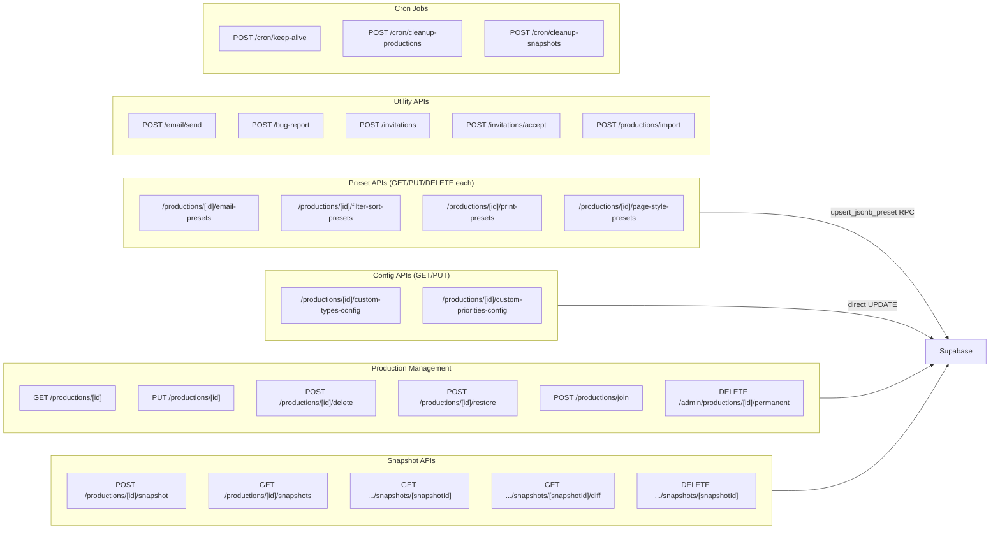

## Module System

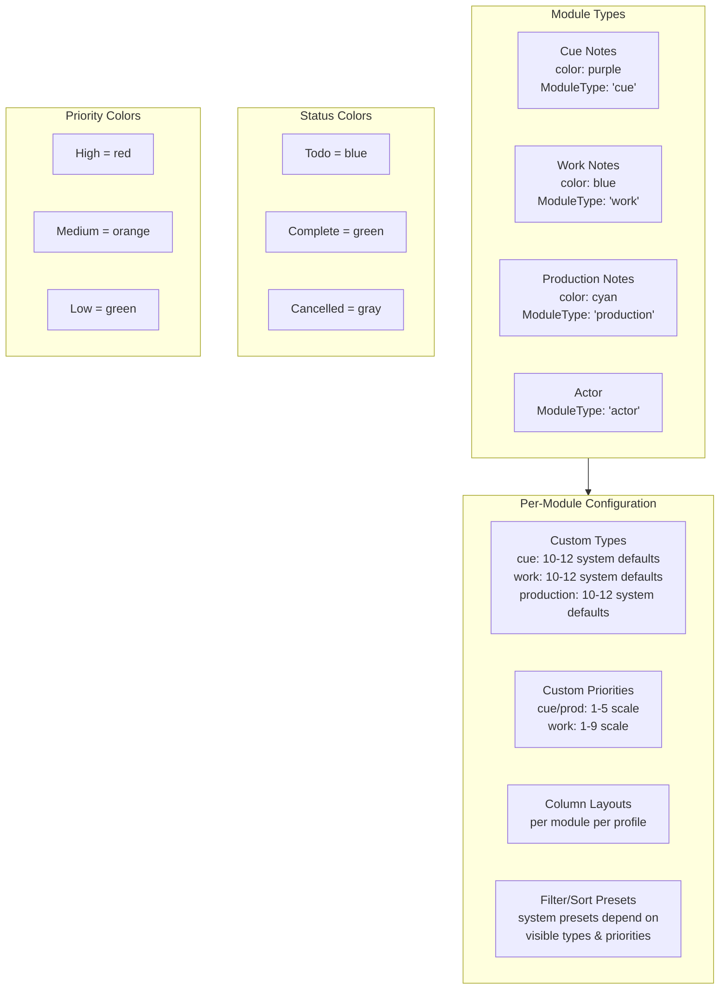

## Realtime Sync

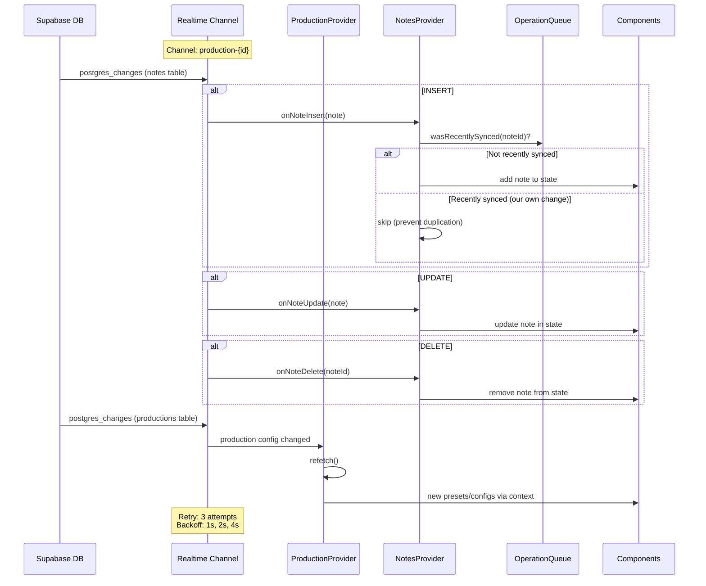

---

## Key Patterns Reference

### System vs Custom Pattern
- System defaults: hardcoded or dynamically generated (prefixed `sys-`)
- Custom: user-defined, stored in JSONB
- Overrides: modify system default label/color/hidden
- Final list = merge(system + custom + overrides)

### Production Config JSONB Pattern
1. Migration: add JSONB column to `productions` table
2. API Route: `app/api/productions/[id]/<config>/route.ts`
3. Storage Adapter: map column in `getProduction()`
4. Production Provider: add to interface, context, sync
5. Hook: `lib/hooks/use-production-<feature>.ts`
6. Zustand Store: `loadFromProduction()` + `getConfig()`

### Demo Mode Fallback
- Production context = null → hooks use local Zustand stores
- Stores persist to localStorage/sessionStorage
- No API calls; mock data via mock-notes-store

### Auth Flow
All API routes: `supabase.auth.getUser()` → `isProductionMember()` or `isProductionAdmin()`
